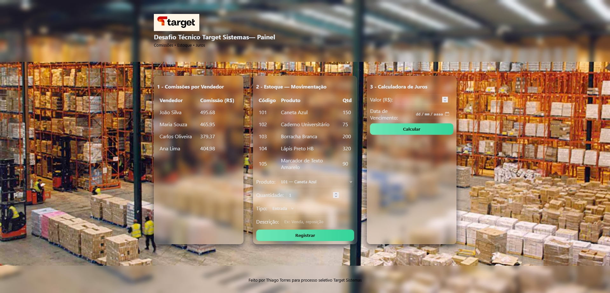

# Desafio Técnico Target Sistemas para a vaga de Desenvolvedor/a de Sistemas Jr.



## Estrutura incluída:

/src - scripts Node.js (desafio1.js, desafio2.js, desafio3.js)
/data - JSONs completos (vendas.json, estoque.json)
/frontend - aplicação visual (index.html, styles.css, app.js)
desafio_formal.pdf - documentação formal
README.md - este arquivo

## Como usar (localmente)

1. Descompacte o pacote.
2. Para executar os scripts Node.js: `node src/desafio1.js`
3. Para abrir o front-end localmente de forma correta (fetch das JSONs):
   - Rode um servidor estático na raiz do pacote. Exemplo rápido com Node: 
     `npx http-server .` (ou `python -m http.server 8000`)
   - Acesse `http://localhost:8080/frontend/` (ou porta usada).

   ---

## 🧩 Estrutura do Projeto

```text
/
├── assets/
│   ├── bg01.jpg
│   ├── favicon.png
│   └── targetlogo.jpg
├── data/
│   ├── estoque.json
│   └── vendas.json
├── docs/
│   ├── app.js
│   ├── index.html
│   └── style.css
├── src/
│   ├── desafio1.js
│   ├── desafio2.js
│   └── desafio3.js
└── README.md

```

---
---

## 🚀 Meu Portifólio

🔗 **Acesse o site:** [thiagotorres.dev](https://thiagotorres.dev/)  

---
---

📬 Contact | Contato

[](mailto:thiago.guitarrista@bol.com.br)

[](https://linkedin.com/in/thiagotorresferrao)

[](https://github.com/ThiagoTorresFerrao)

[](https://www.instagram.com/thiagotorresferrao/)

[](https://www.youtube.com/@Thiago_Torres)

[](https://wa.me/5535997629116)


Sinta-se à vontade para entrar em contato para colaborações, oportunidades ou apenas um bate-papo sobre tecnologia.
Feel free to reach out for collaborations, job opportunities, or just to talk about tech.

🏷️ License | Licença

Este projeto está sob a licença MIT.

This project is licensed under the MIT License.


💬 Quote | Citação

"Technology is not just my job — it's my passion since childhood."
“A tecnologia não é apenas meu trabalho — é minha paixão desde a infância.”

---